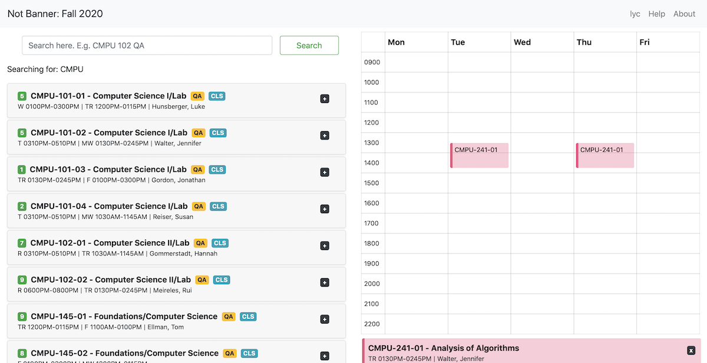

## NotBanner Django
NotBanner is a replacement for Vassar College's schedule of classes. It is a mobile-friendly website that allows users to search for courses and create a course schedule easily. 

## Motivation
NotBanner was developed to simplify the process of searching for courses. Previously, students had to jump between the schedule of classes, which contains information about the classes being offered, and the course catalogue, which provides a description of the course and the pre-requisites there are. This process is tedious, especially when the schedule of classes website is difficult to read, especially on mobile. We hence developed NotBanner to bring these two sources of information together in an easy-to-use, mobile-friendly format. 

## Screenshots

## Tech/framework used

<b>Built with</b>
- [Django](https://www.djangoproject.com)
- [Bootstrap](https://getbootstrap.com)

## Installation
To run NotBanner, clone this repository and install a virtual environment with the dependencies described in the <code>requirements.txt</code> file. Steps to do so can be found here: https://packaging.python.org/guides/installing-using-pip-and-virtual-environments/

The commands henceforth should be entered into the terminal at the project root where the file manage.py sits, after activating the virtual environment. Instructions on how to activate the virtual environment can be found in the link above. 

Create the database by using the following commands: 

    python manage.py makemigrations
    python manage.py migrate

Populate the database by scraping data from Vassar's schedule of classes and course catalogue: 

    python manage.py update_numbers
    python manage.py update_desc
  
Serve Notbanner on http://localhost:8000/: 

    python manage.py runserver
